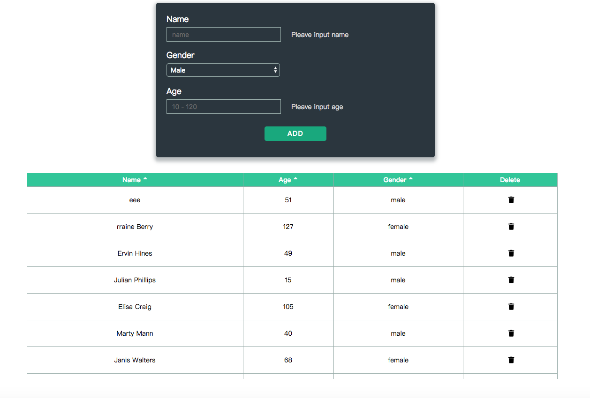

##Digital Goodie programming assignment

####Ke Wang

### How to start

In your terminal,

```
cd digital-goodie-test
npm install 
npm start
```
The app then can be viewed on localhost:3000.

###Screenshot


### App Design

This web page is built only upon React.js, SCSS and other necessary dependencies, without using libraries of the table, form etc. 

Thus, the styles might not be very nice, but functionalities (sort, delete, inline edit, form validation) that are required should be working.


